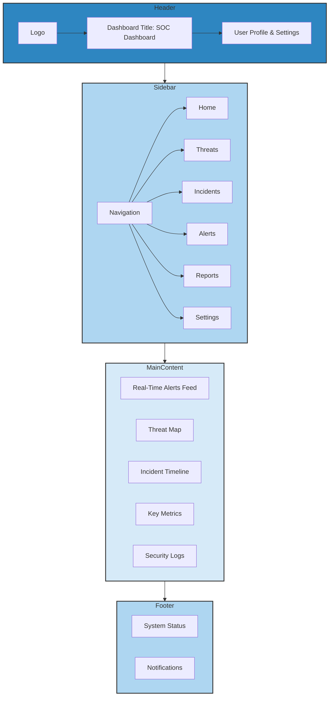
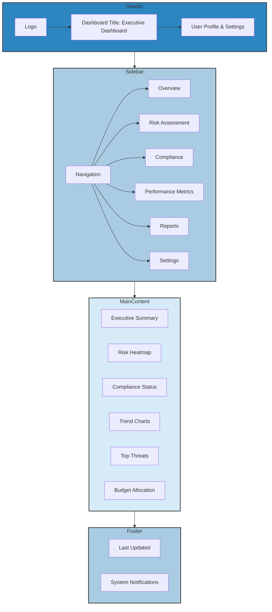
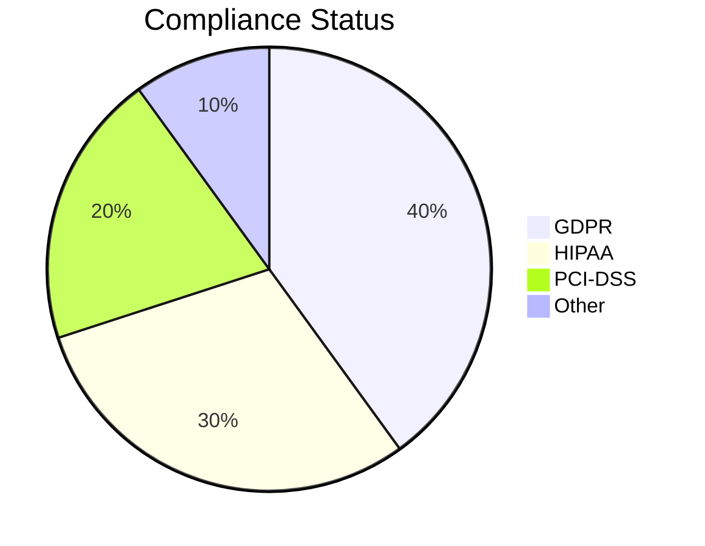

Certainly! Below is **Appendix D: Dashboard Mockups**, showcasing mockups for both **Security Operations Center (SOC)** and **Executive** dashboards. These mockups are designed using **Mermaid** diagrams within Markdown to illustrate the layout and key components. Additionally, I've incorporated **ASCII art** and **tables** where appropriate to enhance clarity and visualization.

---

## Appendix D: Dashboard Mockups

### 1. Security Operations Center (SOC) Dashboard

The SOC Dashboard is tailored for security analysts and operational teams, providing real-time insights, alerts, and detailed metrics to monitor and respond to security threats effectively.

#### **Mermaid Diagram: SOC Dashboard Layout**

```markdown

```

#### **Mockup Description**

1. **Header:**
   - **Logo:** Company or application logo.
   - **Dashboard Title:** Clearly indicates the dashboard type (SOC Dashboard).
   - **User Profile & Settings:** Access to user-specific settings and profile management.

2. **Sidebar:**
   - **Navigation Menu:** Provides quick access to various sections:
     - **Home:** Overview of dashboard.
     - **Threats:** Detailed view of current and past threats.
     - **Incidents:** Logs and management of security incidents.
     - **Alerts:** Real-time alerts and notifications.
     - **Reports:** Generation and access to security reports.
     - **Settings:** Configuration options for the dashboard and alerts.

3. **Main Content Area:**
   - **Real-Time Alerts Feed:** Displays incoming security alerts with severity indicators.
   - **Threat Map:** Geographical representation of active threats and their locations.
   - **Incident Timeline:** Chronological view of incident occurrences and resolutions.
   - **Key Metrics:** Summary of essential security metrics such as:
     - Number of active threats
     - Number of incidents resolved today
     - Average response time
   - **Security Logs:** Detailed logs for in-depth analysis and auditing.

4. **Footer:**
   - **System Status:** Indicates the operational status of various system components.
   - **Notifications:** Displays recent notifications and system messages.

---

### 2. Executive Dashboard

The Executive Dashboard is designed for C-level executives and decision-makers, offering high-level overviews, strategic metrics, and performance indicators to assess the organization's security posture and make informed decisions.

#### **Mermaid Diagram: Executive Dashboard Layout**

```markdown

```

#### **Mockup Description**

1. **Header:**
   - **Logo:** Represents the organization or dashboard application.
   - **Dashboard Title:** Clearly identifies the dashboard as the Executive Dashboard.
   - **User Profile & Settings:** Allows executives to manage their profiles and adjust settings.

2. **Sidebar:**
   - **Navigation Menu:** Provides access to key sections:
     - **Overview:** High-level summary of security status.
     - **Risk Assessment:** Detailed analysis of potential risks and vulnerabilities.
     - **Compliance:** Status of compliance with relevant regulations and standards.
     - **Performance Metrics:** Key performance indicators related to security operations.
     - **Reports:** Access to generated reports and analytics.
     - **Settings:** Configuration options for the dashboard.

3. **Main Content Area:**
   - **Executive Summary:** Concise overview of the current security posture, recent incidents, and key achievements.
   - **Risk Heatmap:** Visual representation of risks across different departments or regions.
   - **Compliance Status:** Indicators showing compliance levels with various standards (e.g., GDPR, HIPAA).
   - **Trend Charts:** Graphs depicting trends over time, such as:
     - Number of incidents over the past quarter
     - Improvement in response times
   - **Top Threats:** Highlighting the most significant threats currently facing the organization.
   - **Budget Allocation:** Visualization of budget distribution across different security initiatives.

4. **Footer:**
   - **Last Updated:** Timestamp indicating the last time the dashboard data was refreshed.
   - **System Notifications:** Displays important system messages or alerts relevant to executives.

---

### 3. Additional Visual Elements

While Mermaid provides a structured way to represent dashboard layouts, incorporating additional visual elements can enhance the mockups. Below are some examples using **ASCII art** and **tables** for specific components.

#### **ASCII Art: Threat Map Widget (SOC Dashboard)**

```
+---------------------------+
|        Threat Map         |
|                           |
|   [●] Location A          |
|   [●] Location B          |
|   [●] Location C          |
|                           |
|   [Zoom In] [Zoom Out]    |
+---------------------------+
```

#### **Table: Key Metrics (SOC Dashboard)**

| Metric                  | Value   | Trend    |
|-------------------------|---------|----------|
| Active Threats          | 15      | 🔺 Up    |
| Incidents Resolved Today| 8       | 🔻 Down   |
| Average Response Time   | 45 min  | ➡ Stable |
| Security Breaches       | 2       | 🔺 Up    |

#### **Mermaid Pie Chart: Compliance Status (Executive Dashboard)**

```markdown

```

#### **Mermaid Bar Chart: Incident Trends (Executive Dashboard)**

```markdown
```mermaid
%%{init: {'theme': 'default'}}%%
bar
    title Incidents Over Time
    xAxis January February March April May June
    yAxis Number of Incidents
    series
        name: "2023"
        data: [5, 7, 3, 6, 4, 8]
        name: "2024"
        data: [6, 9, 4, 7, 5, 10]
```
```

---

### 4. Integration with Other Design Tools

For more advanced and visually appealing mockups, integrating Mermaid diagrams with other design libraries and tools can be beneficial. Below are some recommendations:

- **Chart.js or D3.js:** For dynamic and interactive charts within the dashboard.
- **Bootstrap or Tailwind CSS:** To enhance the styling and responsiveness of the dashboard components.
- **Figma or Adobe XD:** For detailed and high-fidelity UI/UX design mockups that go beyond text-based representations.

However, within the constraints of Markdown and Mermaid, the above mockups provide a comprehensive overview of the dashboard structures and key components.

---

### 5. Rendering the Mockups

To visualize these dashboard mockups:

1. **Use a Markdown Renderer with Mermaid Support:** Platforms like **GitHub**, **GitLab**, **VS Code** (with appropriate extensions), or **Mermaid Live Editor** can render the Mermaid diagrams accurately.
2. **Ensure Proper Formatting:** Copy the code blocks as-is into your Markdown file to maintain the structure and styling.
3. **Enhance with CSS (Optional):** For advanced styling, consider embedding custom CSS or using Markdown extensions that support additional styling options.

---

### 6. Final Notes

- **Scalability:** As your dashboard evolves, consider modularizing components to maintain clarity and manageability.
- **Interactivity:** While Mermaid provides static diagrams, integrating interactive elements can significantly enhance the user experience.
- **User Feedback:** Incorporate feedback from end-users (SOC analysts and executives) to refine and optimize the dashboard layouts and functionalities.

Feel free to customize and expand upon these mockups to suit your specific requirements and organizational needs.
